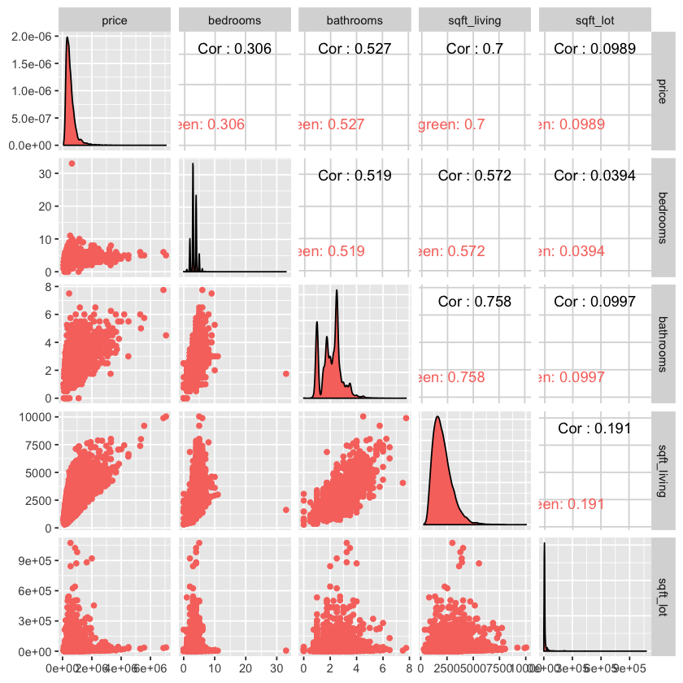
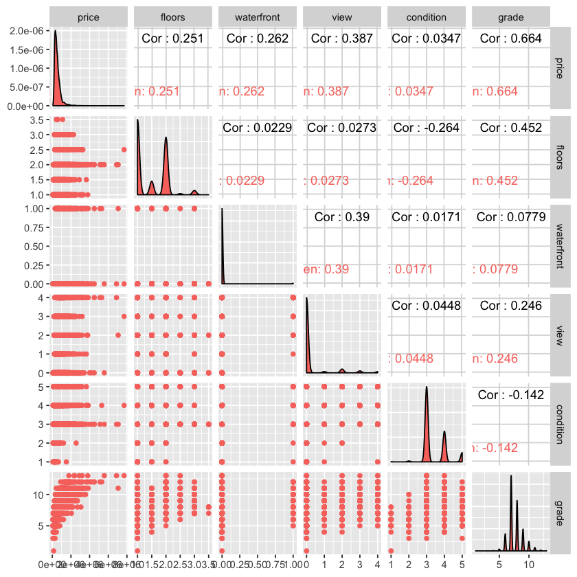
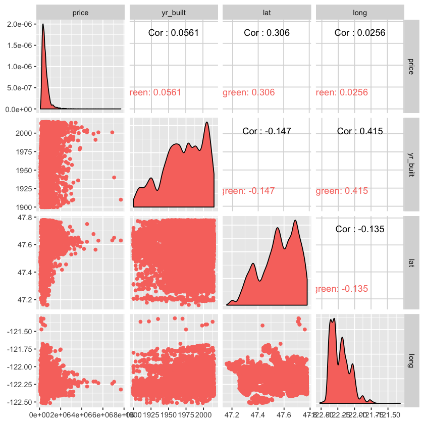
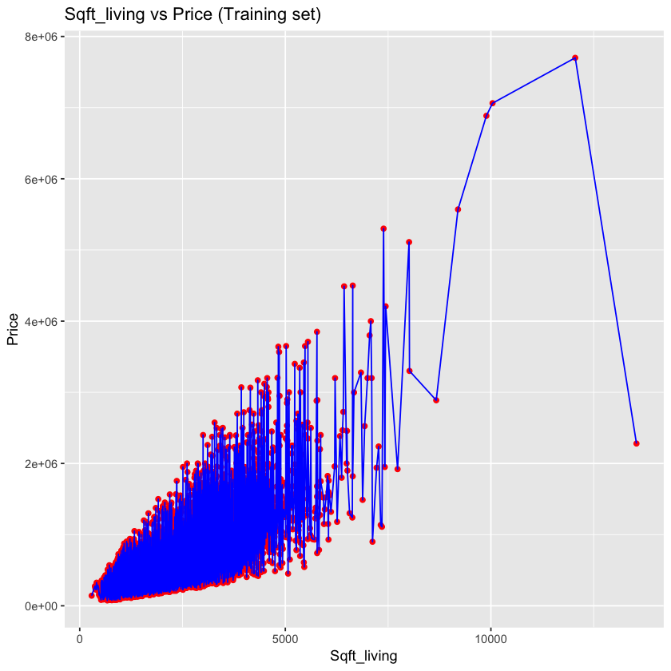
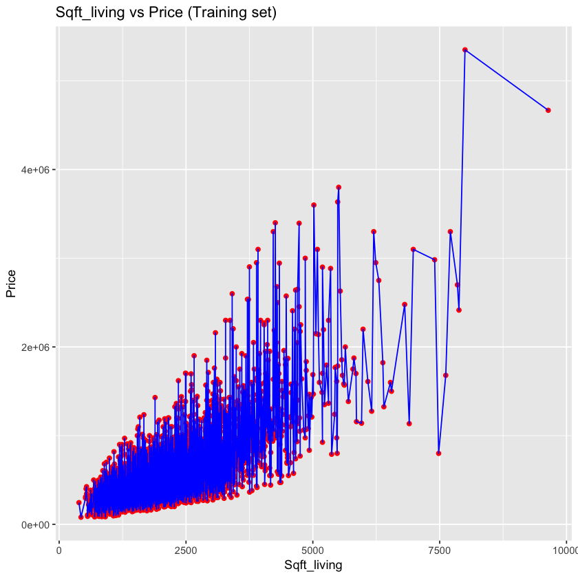
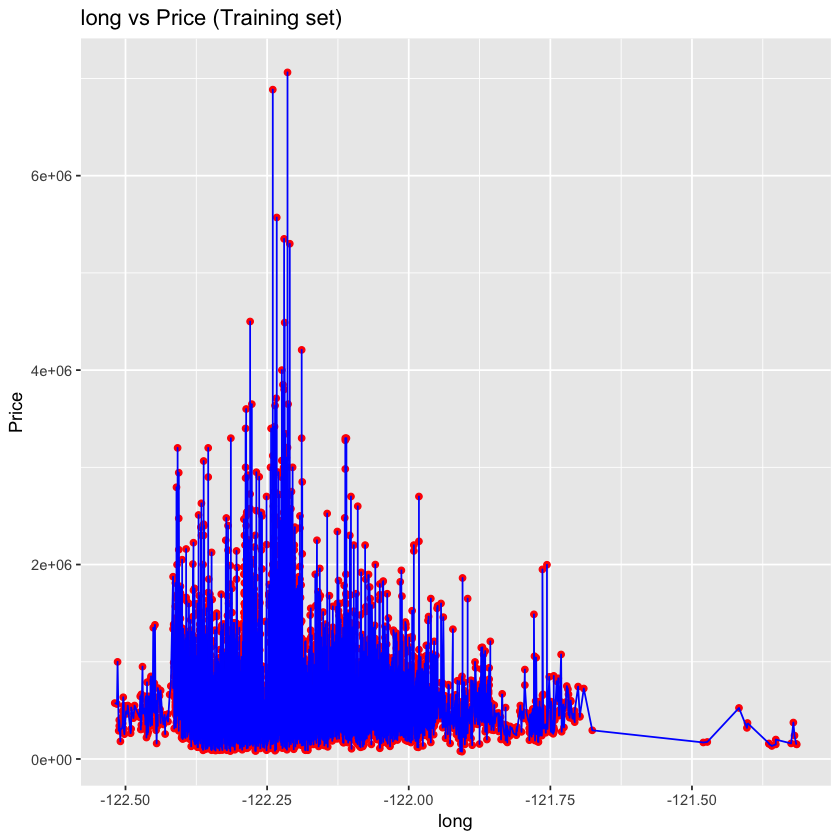

## * INTRO 
- Predict house price using regression (House Sales in King County, USA )
- This dataset contains house sale prices for King County, which includes Seattle. It includes homes sold between May 2014 and May 2015.

## * Suggestion ( application in biz)
During playing this house data, we get much sense about how the property market works in King County, USA.
One of the intetesting application is : Build a simple *** house price predict system *** for the people/sales
who want to run their business in this market. The system can not only help people forcast price for new released house, but also can be a good tool to validate if the price of existing houses make sense or not.

Here list some variables we think are important to the house price
>- bedrooms
- bathrooms
- sqft_living
- condition
- long
- lat 

Apparently we can do some feature engineering build much more interesting features (e.g. : sqft_total= sqft_living+ sqft_lot), but since we dont have too much time dig into feature engineering here. so will leave it to future works.


##  * Variables 
* id  : a notation for a house
* date  : Date house was sold
* price : Price is prediction target
* bedrooms : Number of Bedrooms/House
* bathrooms  : Number of bathrooms/bedrooms
* sqft_living : square footage of the home
* sqft_lot square  :footage of the lot
* floors  : Total floors (levels) in house
* waterfront :  House which has a view to a waterfront
* view : Has been viewed
* condition : How good the condition is ( Overall )
* grade : overall grade given to the housing unit, based on King County grading system
* sqft_above  : square footage of house apart from basement
* sqft_basement :  square footage of the basement
* yr_built : Built Year
* yr_renovated : Year when house was renovated
* zipcode : zip
* lat :  Latitude coordinate
* long  : Longitude coordinate
* sqft_living15  : Living room area in 2015(implies-- some renovations) This might or might not have affected the lotsize area
* sqft_lot15  : lotSize area in 2015(implies-- some renovations)


```R
# import library 

library(lubridate)
library(GGally)
library(ggplot2)
#library(hydroGOF)
library(mvtnorm)

# installing to /Users/yennanliu/anaconda3/envs/python_R/lib/R/library/utf8/libs
#install.packages("ggplot2")
#install.packages("lubridate")
#install.packages("GGally")
#install.packages("mvtnorm")

```

# 0) Get data 


```R
# load the data 
House <- read.csv(file="/Users/yennanliu/analysis/project/rev/Analytics/kc_house_data.csv",head=TRUE,sep=",")
```


```R
head(House, n = 3L)
```


<table>
<thead><tr><th scope=col>id</th><th scope=col>date</th><th scope=col>price</th><th scope=col>bedrooms</th><th scope=col>bathrooms</th><th scope=col>sqft_living</th><th scope=col>sqft_lot</th><th scope=col>floors</th><th scope=col>waterfront</th><th scope=col>view</th><th scope=col>⋯</th><th scope=col>grade</th><th scope=col>sqft_above</th><th scope=col>sqft_basement</th><th scope=col>yr_built</th><th scope=col>yr_renovated</th><th scope=col>zipcode</th><th scope=col>lat</th><th scope=col>long</th><th scope=col>sqft_living15</th><th scope=col>sqft_lot15</th></tr></thead>
<tbody>
	<tr><td>7129300520     </td><td>20141013T000000</td><td>221900         </td><td>3              </td><td>1.00           </td><td>1180           </td><td> 5650          </td><td>1              </td><td>0              </td><td>0              </td><td>⋯              </td><td>7              </td><td>1180           </td><td>  0            </td><td>1955           </td><td>   0           </td><td>98178          </td><td>47.5112        </td><td>-122.257       </td><td>1340           </td><td>5650           </td></tr>
	<tr><td>6414100192     </td><td>20141209T000000</td><td>538000         </td><td>3              </td><td>2.25           </td><td>2570           </td><td> 7242          </td><td>2              </td><td>0              </td><td>0              </td><td>⋯              </td><td>7              </td><td>2170           </td><td>400            </td><td>1951           </td><td>1991           </td><td>98125          </td><td>47.7210        </td><td>-122.319       </td><td>1690           </td><td>7639           </td></tr>
	<tr><td>5631500400     </td><td>20150225T000000</td><td>180000         </td><td>2              </td><td>1.00           </td><td> 770           </td><td>10000          </td><td>1              </td><td>0              </td><td>0              </td><td>⋯              </td><td>6              </td><td> 770           </td><td>  0            </td><td>1933           </td><td>   0           </td><td>98028          </td><td>47.7379        </td><td>-122.233       </td><td>2720           </td><td>8062           </td></tr>
</tbody>
</table>


# 1)  data preprocess 


```R
# data preprocess 
House$date<-(substr(House$date, 1, 8))
House$date<- ymd(House$date)
House$date<-as.numeric(as.Date(House$date, origin = "1900-01-01"))

```


```R
head(House, n = 3L)
```


<table>
<thead><tr><th scope=col>id</th><th scope=col>date</th><th scope=col>price</th><th scope=col>bedrooms</th><th scope=col>bathrooms</th><th scope=col>sqft_living</th><th scope=col>sqft_lot</th><th scope=col>floors</th><th scope=col>waterfront</th><th scope=col>view</th><th scope=col>⋯</th><th scope=col>grade</th><th scope=col>sqft_above</th><th scope=col>sqft_basement</th><th scope=col>yr_built</th><th scope=col>yr_renovated</th><th scope=col>zipcode</th><th scope=col>lat</th><th scope=col>long</th><th scope=col>sqft_living15</th><th scope=col>sqft_lot15</th></tr></thead>
<tbody>
	<tr><td>7129300520</td><td>16356     </td><td>221900    </td><td>3         </td><td>1.00      </td><td>1180      </td><td> 5650     </td><td>1         </td><td>0         </td><td>0         </td><td>⋯         </td><td>7         </td><td>1180      </td><td>  0       </td><td>1955      </td><td>   0      </td><td>98178     </td><td>47.5112   </td><td>-122.257  </td><td>1340      </td><td>5650      </td></tr>
	<tr><td>6414100192</td><td>16413     </td><td>538000    </td><td>3         </td><td>2.25      </td><td>2570      </td><td> 7242     </td><td>2         </td><td>0         </td><td>0         </td><td>⋯         </td><td>7         </td><td>2170      </td><td>400       </td><td>1951      </td><td>1991      </td><td>98125     </td><td>47.7210   </td><td>-122.319  </td><td>1690      </td><td>7639      </td></tr>
	<tr><td>5631500400</td><td>16491     </td><td>180000    </td><td>2         </td><td>1.00      </td><td> 770      </td><td>10000     </td><td>1         </td><td>0         </td><td>0         </td><td>⋯         </td><td>6         </td><td> 770      </td><td>  0       </td><td>1933      </td><td>   0      </td><td>98028     </td><td>47.7379   </td><td>-122.233  </td><td>2720      </td><td>8062      </td></tr>
</tbody>
</table>


```R
# Splitting the Data Set 
ratio = sample(1:nrow(House), size = 0.25*nrow(House))
Test = House[ratio,] #Test dataset 25% of total
Training = House[-ratio,] #Train dataset 75% of total

```

# 2) data visualize

## 2-1) Correlation


```R
# visualize 1 
# Correlation : price VS bedrooms, bathrooms, sqft_living and sqft lot

## Checking Relationship between price, bedrooms, bathrooms, sqft_living and sqft lot
plot1<-ggpairs(data=Training, columns=3:7,
    mapping = aes(color = "dark green"),
    axisLabels="show")
plot1
```





```R
# visualize 2
# Correlation : price VS  floors, waterfront, view, condition and grade

## Checking Relationship between price, floors, waterfront, view, condition and grade
plot2<-ggpairs(data=Training, columns=c(3,8:12),
    mapping = aes(color = "dark green"),
    axisLabels="show")
plot2

```





```R
# visualize 3 
# Correlation : price VS  yr built, lat and long


## Checking Relationship between price, yr built, lat and long
plot3=ggpairs(data=Training, columns=c(3,15,18,19),
    mapping = aes(color = "dark green"),
    axisLabels="show")
plot3
```





```R
# Visualizing the training set 
ggplot() +
  geom_point(aes(x = Training$sqft_living, y = Training$price),
             colour = 'red') +
  geom_line(aes(x = Training$sqft_living, y = Training$price),
            colour = 'blue') +
  ggtitle('Sqft_living vs Price (Training set)') +
  xlab('Sqft_living') +
  ylab('Price')


```





```R
# Visualizing the test set
ggplot() +
  geom_point(aes(x = Test$sqft_living, y = Test$price),
             colour = 'red') +
  geom_line(aes(x = Test$sqft_living, y = Test$price),
            colour = 'blue') +
  ggtitle('Sqft_living vs Price (Training set)') +
  xlab('Sqft_living') +
  ylab('Price')


```





## Observation 
Some variables are apparently strong relative to the price (predict target), 
which make sense in the general house experiences 
i.e.  bigger living place -> much expensive price, much rooms -> high prices , higher grade -> higher prices.. and so on
> 
- Sqft_living 
- bathrooms
- grade
- bedrooms 

However, some variables may be important factors to the price as well, like "locations" : long/ lat, 
but maybe they are not shown as strong relation to the price on the scatter plot. So I'll do some works 
following to show how long/ lat affect prices 
> 
- long
- lat


## 2-2) Location data


```R
# Visualizing the lat VS price (training set )


ggplot() +
  geom_point(aes(x = Training$lat, y = Training$price),
             colour = 'red') +
  geom_line(aes(x = Training$lat, y = Training$price),
            colour = 'blue') +
  ggtitle('lat vs Price (Training set)') +
  xlab('lat') +
  ylab('Price')
```


```R
# Visualizing the long VS price (training set) 
ggplot() +
  geom_point(aes(x = Training$long, y = Training$price),
             colour = 'red') +
  geom_line(aes(x = Training$long, y = Training$price),
            colour = 'blue') +
  ggtitle('long vs Price (Training set)') +
  xlab('long') +
  ylab('Price')


```





## Observation 
Geo-location is a really interesting variable, since they in fact mean the where/which area each house in. Since there is some issues when I tried to access/install map library (ggmap/..) in R.
So here I just plot a simple Lat VS price, and Long VS price scatter plot. Will do much more dig when solving the 
library dependency issue 
> 
- long
- lat

We can see the price distribution within long/lat on plot above. The interesting point is :
Most high price house are located within lat ~= 47.6 and long ~= 122.25 which are in fact the center of the 
city that make sense that "houses are much expensive when located in the downtown".


```R
# end of analysis
```
