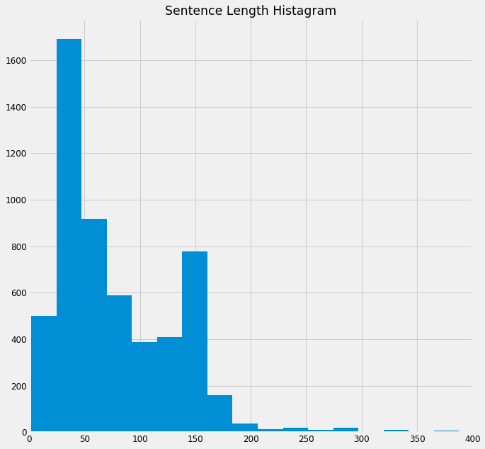
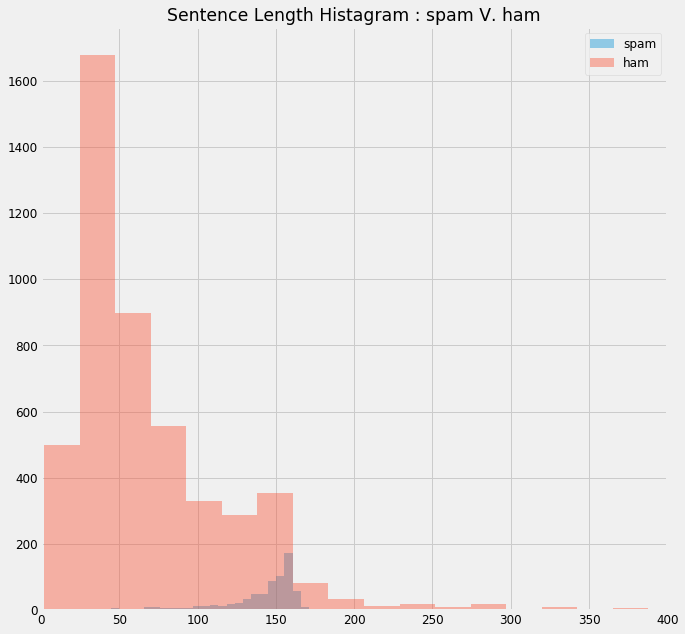
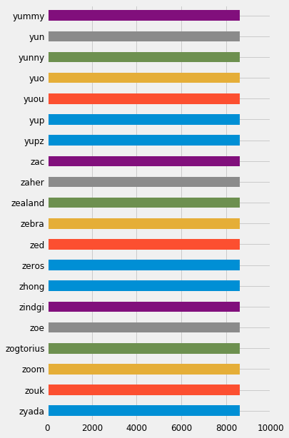

# Credit 

- https://www.kaggle.com/itratrahman/nlp-tutorial-using-python


```python

# OP 
import pandas as pd
import numpy as np
import time
from sklearn.preprocessing import LabelEncoder
from sklearn import preprocessing
from sklearn.feature_extraction.text import CountVectorizer, TfidfVectorizer
from sklearn.model_selection import train_test_split, KFold
from nltk.corpus import stopwords
from nltk.stem.snowball import SnowballStemmer

%matplotlib inline
%pylab inline
import seaborn  as sns 
from matplotlib import pyplot
import matplotlib.pyplot as plt

```

    Populating the interactive namespace from numpy and matplotlib


```python
# set plot style
matplotlib.style.use('fivethirtyeight')
matplotlib.rcParams['font.size'] = 12
matplotlib.rcParams['figure.figsize'] = (10,10)
```

## 0) Load data 


```python
# help fun 

def get_sentence_length(x):
    return len(x)

def remove_punctuation(text):
    '''a function for removing punctuation'''
    import string
    # replacing the punctuations with no space, 
    # which in effect deletes the punctuation marks 
    translator = str.maketrans('', '', string.punctuation)
    # return the text stripped of punctuation marks
    return text.translate(translator)


# stop words : show stop words in English 


def stopwords_(text):
    '''a function for removing the stopword'''
    # removing the stop words and lowercasing the selected words
    sw = stopwords.words('english')
    text = [word.lower() for word in text.split() if word.lower() not in sw]
    # joining the list of words with space separator
    return " ".join(text)


# create an object of stemming function
stemmer = SnowballStemmer("english")
def stemming(text):    
    '''a function which stems each word in the given text'''
    text = [stemmer.stem(word) for word in text.split()]
    return " ".join(text) 
```


```python
# LOAD THE DATA 

df = pd.read_csv('spam.csv', delimiter=',',encoding='latin-1')
df = df.loc[:,['v1','v2']]

# get feature

df['length'] = df['v2'].apply(get_sentence_length)
# remove punctuation
df['v2_del_punct'] = df['v2'].apply(remove_punctuation)
# remove stopwords
df['v2_del_stopword'] = df['v2'].apply(stopwords_)
# get stem
df['v2_stemming'] = df['v2'].apply(stemming)


df.head()
```


<div>
<style scoped>
    .dataframe tbody tr th:only-of-type {
        vertical-align: middle;
    }

    .dataframe tbody tr th {
        vertical-align: top;
    }

    .dataframe thead th {
        text-align: right;
    }
</style>
<table border="1" class="dataframe">
  <thead>
    <tr style="text-align: right;">
      <th></th>
      <th>v1</th>
      <th>v2</th>
      <th>length</th>
      <th>v2_del_punct</th>
      <th>v2_del_stopword</th>
      <th>v2_stemming</th>
    </tr>
  </thead>
  <tbody>
    <tr>
      <th>0</th>
      <td>ham</td>
      <td>Go until jurong point, crazy.. Available only ...</td>
      <td>111</td>
      <td>Go until jurong point crazy Available only in ...</td>
      <td>go jurong point, crazy.. available bugis n gre...</td>
      <td>go until jurong point, crazy.. avail onli in b...</td>
    </tr>
    <tr>
      <th>1</th>
      <td>ham</td>
      <td>Ok lar... Joking wif u oni...</td>
      <td>29</td>
      <td>Ok lar Joking wif u oni</td>
      <td>ok lar... joking wif u oni...</td>
      <td>ok lar... joke wif u oni...</td>
    </tr>
    <tr>
      <th>2</th>
      <td>spam</td>
      <td>Free entry in 2 a wkly comp to win FA Cup fina...</td>
      <td>155</td>
      <td>Free entry in 2 a wkly comp to win FA Cup fina...</td>
      <td>free entry 2 wkly comp win fa cup final tkts 2...</td>
      <td>free entri in 2 a wkli comp to win fa cup fina...</td>
    </tr>
    <tr>
      <th>3</th>
      <td>ham</td>
      <td>U dun say so early hor... U c already then say...</td>
      <td>49</td>
      <td>U dun say so early hor U c already then say</td>
      <td>u dun say early hor... u c already say...</td>
      <td>u dun say so earli hor... u c alreadi then say...</td>
    </tr>
    <tr>
      <th>4</th>
      <td>ham</td>
      <td>Nah I don't think he goes to usf, he lives aro...</td>
      <td>61</td>
      <td>Nah I dont think he goes to usf he lives aroun...</td>
      <td>nah think goes usf, lives around though</td>
      <td>nah i don't think he goe to usf, he live aroun...</td>
    </tr>
  </tbody>
</table>
</div>


## 1) Data Overview


```python
# sentence length hist 

df.length.hist(bins=40)
plt.xlim(0,400)
plt.title('Sentence Length Histagram')
```


    Text(0.5,1,'Sentence Length Histagram')





```python
# sentence length hist  with spam V. ham

df[df.v1 == 'spam' ].length.hist(bins=40,alpha = 0.4)
df[df.v1 == 'ham' ].length.hist(bins=40,alpha = 0.4)
plt.xlim(0,400)
plt.title('Sentence Length Histagram : spam V. ham')
plt.legend(['spam','ham'])
plt.show()
```





```python
X = df.v2
Y = df.v1
le = LabelEncoder()
Y = le.fit_transform(Y)
```


```python
Y.shape
```


    (5572,)


```python
pd.DataFrame(Y)[0].value_counts()
```


    0    4825
    1     747
    Name: 0, dtype: int64


```python
X.iloc[0]
```


    'Go until jurong point, crazy.. Available only in bugis n great world la e buffet... Cine there got amore wat...'


```python
X.iloc[1]
```


    'Ok lar... Joking wif u oni...'


## 1) NLP feature extract 


```python
stopwords
```


    <WordListCorpusReader in '/Users/yennanliu/nltk_data/corpora/stopwords'>


```python
#print("Number of stopwords: ", len(sw))
```


```python
df.head()
```


<div>
<style scoped>
    .dataframe tbody tr th:only-of-type {
        vertical-align: middle;
    }

    .dataframe tbody tr th {
        vertical-align: top;
    }

    .dataframe thead th {
        text-align: right;
    }
</style>
<table border="1" class="dataframe">
  <thead>
    <tr style="text-align: right;">
      <th></th>
      <th>v1</th>
      <th>v2</th>
      <th>length</th>
      <th>v2_del_punct</th>
      <th>v2_del_stopword</th>
      <th>v2_stemming</th>
    </tr>
  </thead>
  <tbody>
    <tr>
      <th>0</th>
      <td>ham</td>
      <td>Go until jurong point, crazy.. Available only ...</td>
      <td>111</td>
      <td>Go until jurong point crazy Available only in ...</td>
      <td>go jurong point, crazy.. available bugis n gre...</td>
      <td>go until jurong point, crazy.. avail onli in b...</td>
    </tr>
    <tr>
      <th>1</th>
      <td>ham</td>
      <td>Ok lar... Joking wif u oni...</td>
      <td>29</td>
      <td>Ok lar Joking wif u oni</td>
      <td>ok lar... joking wif u oni...</td>
      <td>ok lar... joke wif u oni...</td>
    </tr>
    <tr>
      <th>2</th>
      <td>spam</td>
      <td>Free entry in 2 a wkly comp to win FA Cup fina...</td>
      <td>155</td>
      <td>Free entry in 2 a wkly comp to win FA Cup fina...</td>
      <td>free entry 2 wkly comp win fa cup final tkts 2...</td>
      <td>free entri in 2 a wkli comp to win fa cup fina...</td>
    </tr>
    <tr>
      <th>3</th>
      <td>ham</td>
      <td>U dun say so early hor... U c already then say...</td>
      <td>49</td>
      <td>U dun say so early hor U c already then say</td>
      <td>u dun say early hor... u c already say...</td>
      <td>u dun say so earli hor... u c alreadi then say...</td>
    </tr>
    <tr>
      <th>4</th>
      <td>ham</td>
      <td>Nah I don't think he goes to usf, he lives aro...</td>
      <td>61</td>
      <td>Nah I dont think he goes to usf he lives aroun...</td>
      <td>nah think goes usf, lives around though</td>
      <td>nah i don't think he goe to usf, he live aroun...</td>
    </tr>
  </tbody>
</table>
</div>


```python
# Collect vocabulary count


# create a count vectorizer object
count_vectorizer = CountVectorizer()
# fit the count vectorizer using the text data
count_vectorizer.fit(df['v2_del_stopword'])
# collect the vocabulary items used in the vectorizer
dictionary = count_vectorizer.vocabulary_.items()

# lists to store the vocab and counts
vocab = []
count = []
# iterate through each vocab and count append the value to designated lists
for key, value in dictionary:
    vocab.append(key)
    count.append(value)
# store the count in panadas dataframe with vocab as index
vocab_bef_stem = pd.Series(count, index=vocab)
# sort the dataframe
vocab_bef_stem = vocab_bef_stem.sort_values(ascending=False)
```


```python
# plot top vacab.

top_vacab = vocab_bef_stem[20:40]
top_vacab.plot(kind = 'barh', figsize=(5,10), xlim= (0, 10000))
```


    <matplotlib.axes._subplots.AxesSubplot at 0x125a3bd68>





```python
# stemming ops 
# run stemming operation 

print ('stemming words :  ')
print ('-'*10)
print ('')
print (df['v2_stemming'].head(5))
print ('-'*10)
print ('original words :  ')
df['v2'].head(5)
```

    stemming words :  
    ----------
    
    0    go until jurong point, crazy.. avail onli in b...
    1                          ok lar... joke wif u oni...
    2    free entri in 2 a wkli comp to win fa cup fina...
    3    u dun say so earli hor... u c alreadi then say...
    4    nah i don't think he goe to usf, he live aroun...
    Name: v2_stemming, dtype: object
    ----------
    original words :  


    0    Go until jurong point, crazy.. Available only ...
    1                        Ok lar... Joking wif u oni...
    2    Free entry in 2 a wkly comp to win FA Cup fina...
    3    U dun say so early hor... U c already then say...
    4    Nah I don't think he goes to usf, he lives aro...
    Name: v2, dtype: object


